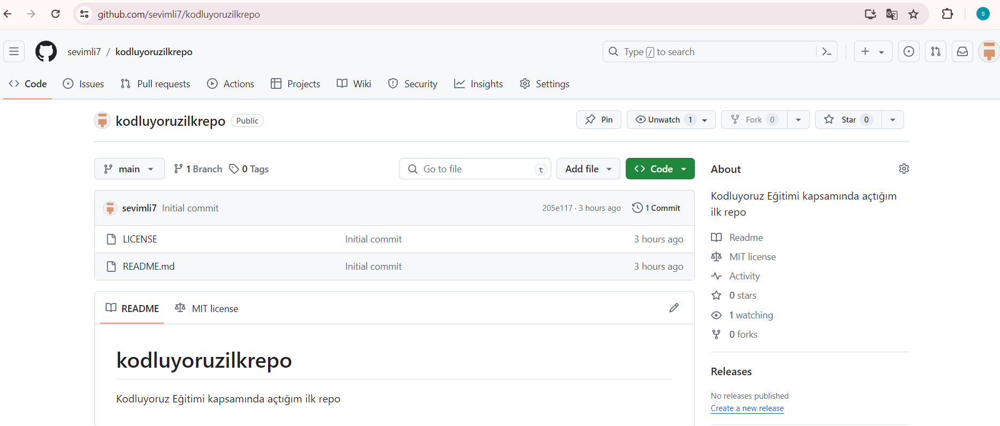

# Kodluyoruz İlk Repo

Bu repo [Kodluyoruz](https://github.com/sevimli7/kodluyoruzilkrepo) Front-End Eğitiminde oluşturduğumuz ilk repo içerisinde bir adet README dosyasıbir adet de index.html barındırıyor.

## Installation

Oncelikle projeyi clonlayın. ( Buraya sizin reponuzdan aldığının link gelecek )

`git clone https://github.com/sevimli7/kodluyoruzilkrepo`

## Usage

Projeyi clonladıktan sonra Visual Studio Code programında açınız.

###### Linux için:

```
cd kodluyoruzilkrepo
code .

```

## Contributing

Pull requestler kabul edilir. Büyük değişiklikler için lütfen önce neyi değiştirmek istediğinizi tartışmak için bir konu açınız.

### License

[MIT](https://github.com/sevimli7/kodluyoruzilkrepo?tab=MIT-1-ov-file)




